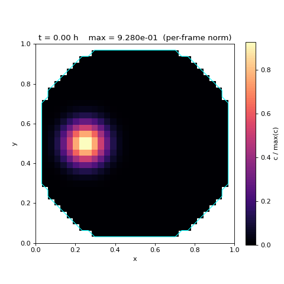
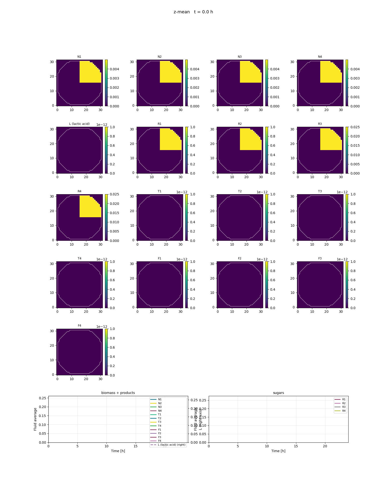
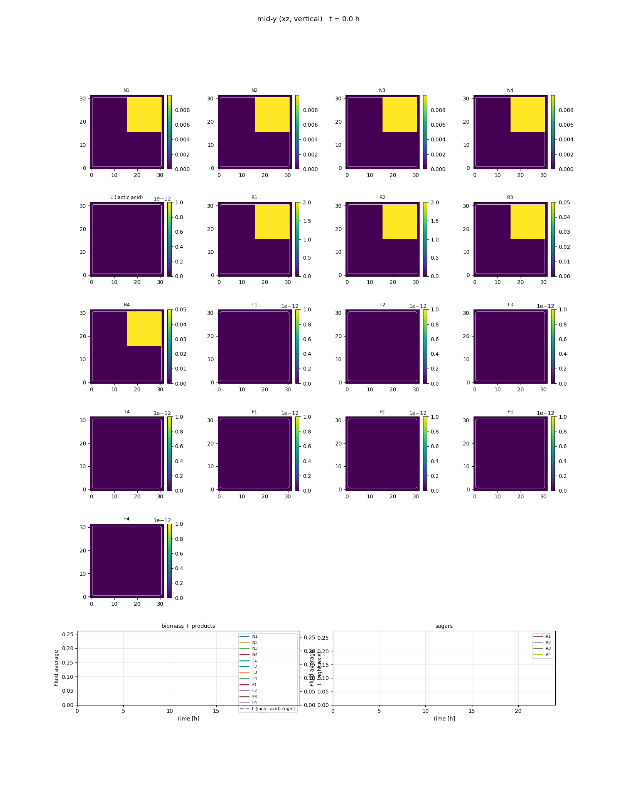

# CooperativeModel

3D reaction-advection simulation of a 4-species Liebig consumer-resource consortium on a cyclic 4-cycle of essential resources, inside a cylindrical stirred tank, implemented in PyTorch.  Mixing is supplied entirely by chaotic advection from a non-axisymmetric impeller body force; there is no explicit (eddy / Fickian) diffusion operator.

The package is organised as a **two-stage pipeline**: a steady incompressible Navier–Stokes solve over the cylinder produces a velocity field once and caches it to HDF5; species transport then integrates the consumer-resource kinetics on top of that fixed flow for every Bayesian-optimisation evaluation. The flow is held constant through the BO loop — concentrations evolve, the velocity field does not.

The architecture follows the **CFD-based compartment-model framing** of Delafosse et al. (2014, *Chemical Engineering Science* **106**, 76–85): each finite-volume cell acts as a compartment whose inter-compartment fluxes come from the resolved velocity field. The impeller is represented as a localised body force in the spirit of Pericleous & Patel (1987) and is **non-axisymmetric** (a single angular Gaussian "blade") so that the resulting Lagrangian streamlines are chaotic rather than purely toroidal.





## Quick Start

```bash
# Stage 1 — solve and cache the steady flow (slow, run once)
python scripts/solve_flow.py --out flow_cache.h5

# Stage 2 — species transport on the cached flow (fast, repeated)
python examples/example.py
```

```python
from CooperativeModel import Simulator

# Stage 2 in code: the BO objective wraps Simulator.run() and never re-solves Stage 1.
# IC channels: [N1..N4, L, R1..R4, T1..T4].  Pair P_1 = {R1, R2}: load R1, R2 high,
# R3, R4 low; species N1 dominates and produces lactate.
r = Simulator(
    samples=[[0.01, 0.01, 0.01, 0.01, 0.0,
              2.0, 2.0, 0.05, 0.05,
              0.0, 0.0, 0.0, 0.0]],
    t_final=24.0, grid_shape=(32, 32, 32),
    flow_cache_path='flow_cache.h5',
    ic_mode='uniform',
    device='cuda',
).run()
print(f'L={r.L_final:.4f}')
r.gif('sample0.gif')              # mid-z slice, wall boundary contoured

# Well-mixed limit: 1x1x1 grid, no flow → the 13-ODE system.
r = Simulator(samples=[[0.01, 0.01, 0.01, 0.01, 0.0,
                        2.0, 2.0, 0.05, 0.05,
                        0.0, 0.0, 0.0, 0.0]],
              grid_shape=(1, 1, 1), flow_cache_path=None,
              t_final=24.0).run()
```

See [`examples/example.py`](examples/example.py) and [`examples/find_optima.py`](examples/find_optima.py) for the full runnable scripts.

## Model

### State Variables (13 channels)

| Symbol | Channel | Description |
|--------|---------|-------------|
| $N_1, N_2, N_3, N_4$ | 0–3 | Per-species biomass (4-cycle of consumers) |
| $L$                  | 4   | Lactate-style scalar objective |
| $R_1, R_2, R_3, R_4$ | 5–8 | Primary essential resources |
| $T_1, T_2, T_3, T_4$ | 9–12 | Per-species (bacteriocin-style) toxins |

### Well-Mixed ODE (Local Reaction Kinetics)

A textbook 4-species Liebig consumer-resource model (Tilman 1980; Marsland et al. 2019; Goyal & Maslov 2018) on a **cyclic 4-cycle** of species and essential resources, layered with **two multiplicative Hill-form inhibitors** so that the four "pair corners" of the resource initial-condition box emerge as four clean local optima of $L_{\text{final}}$.

**Pairing.** Each species $i$ requires *both* resources in its pair $P_i$:

$$P_1 = \{R_1, R_2\}, \quad P_2 = \{R_2, R_3\}, \quad P_3 = \{R_3, R_4\}, \quad P_4 = \{R_4, R_1\}$$

so each resource is essential to exactly two species and each species is Liebig-limited by whichever paired resource is in shortest supply:

$$\text{Liebig}_i(\mathbf{R}) \;:=\; \min_{j \in P_i} \frac{R_j}{K + R_j}$$

**Inhibition 1 — Resource-mediated (anti-nutrient) Hill.** Each species $i$ is repressed by the **sum of its two non-paired resources** on the cycle:

$$\text{poison}_i \;:=\; R_{(i+2)\bmod 4} + R_{(i+3)\bmod 4} \qquad \text{inh}^R_i \;:=\; \frac{K^{h_R}}{K^{h_R} + \text{poison}_i^{h_R}}$$

Using *both* non-paired resources (not only the antipodal one) collapses the otherwise-flat "extra resource" plateau in $L(\mathbf{R}_{\text{init}})$: any three-sugar-HI configuration drives one of the would-be grower's non-paired resources HI, suppressing it. Only the four pure pair corners — paired R's HI, both non-paired R's LO — leave a species fully un-poisoned. Biology: end-product / pH / undissociated organic-acid stress, allelopathic secondary metabolite, or differential ion susceptibility.

**Inhibition 2 — Toxin-mediated (bacteriocin-style) Hill.** Each species $i$ secretes its own toxin $T_i$ at a rate proportional to its growth flux, decays first-order, and is **immune to its own toxin** (the cross-toxin pool seen by $N_i$ excludes $T_i$):

$$T_{\text{other},i} \;:=\; \textstyle\sum_{j \neq i} T_j \;=\; T_{\text{tot}} - T_i \qquad \text{inh}^T_i \;:=\; \frac{K_T^{h_T}}{K_T^{h_T} + T_{\text{other},i}^{h_T}}$$

$$\frac{dT_i}{dt} \;=\; \beta \, g_i \, N_i \;-\; \gamma \, T_i$$

Slow first-order decay ($\gamma$ small relative to the growth time scale) makes $T_i$ **persist** after the producer's paired resources are gone, which closes the "depletion cascade" loophole: once the dominant species at a pair corner has consumed its paired resources, the R-poisons on its competitors also drop — without the persistent toxin term a suppressed species would otherwise wake up and leak L.

**Crucially, both inhibition factors multiply the growth rate, not a death rate.** An inhibited species simply does not grow — it consumes no resource and produces no L. This avoids the spurious "transient growth then die" L-leak that any linear cell-death term would introduce, and is what makes the all-max corner cleanly *non-optimal* (every species fully poisoned, total $L$ small) rather than a partially-active bath.

**Net specific growth rate** (Liebig × R-Hill × T-Hill, all multiplicative):

$$g_i \;:=\; \mu_i \,\cdot\, \text{inh}^R_i \,\cdot\, \text{inh}^T_i \,\cdot\, \text{Liebig}_i(\mathbf{R})$$

**Full batch ODE system** at a voxel:

$$\frac{dN_i}{dt} = g_i \, N_i \qquad \frac{dL}{dt} = \sum_i Y_i \, g_i \, N_i$$

$$\frac{dR_j}{dt} = -\!\!\sum_{i \,:\, j \in P_i}\! c_i \, g_i \, N_i \qquad \frac{dT_i}{dt} = \beta \, g_i \, N_i - \gamma \, T_i$$

All operations are vectorised over the spatial grid $[B, 13, N_z, N_y, N_x]$ — the same `compute_reaction_rates` is reused in the well-mixed and 3D regimes since local kinetics is purely pointwise.

### Parameters (Table 1)

Defaults in `ModelParameters` (see `src/CooperativeModel/config.py`):

| Symbol | Description | Value |
|--------|-------------|-------|
| $\mu_i$           | Per-species max growth rate                    | $[1, 1, 1, 1]$ h$^{-1}$ |
| $K$               | Monod half-saturation (also R-Hill $K$)        | $0.5$ |
| $h_R$             | Hill exponent for R-poison inhibition          | $4$ |
| $c_i$             | Per-species stoichiometric uptake coefficient  | $[1, 1, 1, 1]$ |
| $Y_i$             | Per-species lactate yield (asymmetry-breaker)  | $[0.995,\; 1.001,\; 1.005,\; 0.999]$ |
| $\beta$           | Toxin production per growth flux                | $1.0$ |
| $\gamma$          | Toxin first-order decay rate                    | $0.1$ h$^{-1}$ |
| $K_T$             | Hill $K$ for toxin inhibition                   | $0.5$ |
| $h_T$             | Hill exponent for toxin inhibition              | $4$ |

The symmetric base values $\mu_i, c_i = 1$ and $K = K_T$, $h_R = h_T$ give four equal-height pair-corner optima. Slight $Y$ heterogeneity breaks the exact cyclic degeneracy so the four optima are distinguishable but tightly clustered (within $\sim 1\%$ of each other).

### Where the four local optima come from

`examples/find_optima.py` runs a batched landscape scan + greedy seeding + L-BFGS-B refinement over the well-mixed system and reports the distinct local optima of $L_{\text{final}}(R_1, R_2, R_3, R_4)$. With the current defaults the top four are exactly the four pair corners, with a **~36 % gap** to the next-best candidate:

| # | $R_1$ | $R_2$ | $R_3$ | $R_4$ | $L_{\text{final}}$ | corner |
|---|-------|-------|-------|-------|--------------------|--------|
| 1 | 0.05  | 2.00  | 2.00  | 0.05  | 2.017              | $P_2$ (N2 grows) |
| 2 | 0.05  | 0.05  | 2.00  | 2.00  | 2.015              | $P_3$ (N3 grows) |
| 3 | 2.00  | 0.05  | 0.05  | 2.00  | 2.014              | $P_4$ (N4 grows) |
| 4 | 2.00  | 2.00  | 0.05  | 0.05  | 2.003              | $P_1$ (N1 grows) |
| 5 | 1.18  | 0.10  | 0.22  | 1.38  | 1.284              | — |

Mechanistically: at a pair corner $P_i$ both of species $i$'s paired resources are HI and both of its non-paired resources are LO. The R-Hill is therefore $\sim 1$, Liebig is $\sim 1$, and the toxin pool is dominated by $T_i$ which $N_i$ is immune to. Every other species has either a Liebig-killed pair (a paired R is LO) or an HI non-paired R that suppresses its R-Hill. Once $N_i$ is the only grower, persistent $T_i$ keeps the late-phase cascade closed and $N_i$ runs the paired resources down on its own.

### 3D Spatial Extension (PDE)

Each species $y_k$ evolves on a $32\times32\times32$ Cartesian grid masked to a cylindrical fluid region (axis = $z$, $H/D = 1$, the cylinder fills the cube):

$$\frac{\partial y_k}{\partial t} = R_k(\mathbf{y}) - \nabla \cdot (\mathbf{v} \, y_k)$$

where:
- $R_k(\mathbf{y})$ — local reaction rate from the ODE above (kinetics is purely local, so the same `compute_reaction_rates` is reused across the well-mixed and 3D regimes).
- $-\nabla \cdot (\mathbf{v} \, y_k)$ — advection by the cached velocity field (conservative first-order upwind on the open-face MAC stencil; flux is killed at any face touching a wall).

**No explicit (Fickian / eddy) diffusion operator.**  Mixing is supplied entirely by chaotic advection from the non-axisymmetric impeller force, plus the small numerical diffusion implicit in first-order upwind on the $32^3$ grid.  This is a deliberate choice: the impeller's chaotic Lagrangian streamlines do the mixing the same way they would in a real stirred tank, and a sub-grid eddy-diffusivity term would just smear out the structure that the projection chain takes care to preserve.

**Open-face MAC stencil.** Both the Stage-1 projection and the Stage-2 advection use the same forward-difference divergence with face-flux indicators $\text{op}_{xp}[i] = \text{mask}[i]\cdot\text{mask}[i{+}1]$.  Because the projection drives this exact divergence to zero, a spatially uniform passive scalar is preserved *exactly* under the converged flow (verified in `tests/`).  Mass over the fluid region is conserved to ODE-solver tolerance.

**Time integration** — Tsitouras 5(4) adaptive Runge–Kutta with dense output via cubic Hermite interpolation and built-in non-negativity clamping. The advective CFL is automatic:

$$\Delta t_{\text{adv}} < \frac{\Delta x}{|\mathbf{v}|_{\max}}$$

Reaction stiffness is handled by the adaptive controller.

### Stage 1 — Steady NS solve and HDF5 cache

The cylindrical-tank flow is computed once by `solve_steady_flow` (in `flow_3d.py`) and cached to disk by `scripts/solve_flow.py`. The Bayesian-optimisation loop loads the cache and **never** re-solves the flow.

**Geometry.** Closed cylinder ($H/D = 1$) inscribed in a unit cube; the wall mask is built by `cylinder_mask`. No inlet, no outlet — the previous 2D `flow_through` mode is removed, since the spec is a closed vessel.

**Forcing — non-axisymmetric impeller body force.** Following the body-force impeller approach of Pericleous & Patel (1987), the impeller is represented as a localised tangential body force rather than a no-slip moving boundary. The new ingredient compared to the classical axisymmetric form is a single angular Gaussian "blade":

$$\mathbf{f}(r,\theta,z) \;=\; F_0 \,\chi_{rz}(r,z)\,\chi_\theta(\theta)\, \hat{\boldsymbol{\theta}}$$

$$\chi_{rz}(r,z) = \exp\!\left(-\frac{(r-r_{\text{imp}})^2}{2\sigma_r^2} - \frac{(z-z_{\text{imp}})^2}{2\sigma_z^2}\right) \qquad \chi_\theta(\theta) = \exp\!\left(-\frac{d_{\text{circ}}(\theta,\theta_0)^2}{2\sigma_\theta^2}\right)$$

with $d_{\text{circ}}(\theta,\theta_0) = \min(|\theta-\theta_0|,\,2\pi-|\theta-\theta_0|)$. The angular blade breaks the toroidal $\theta$-symmetry of the otherwise axisymmetric forcing. This azimuthal asymmetry is what unlocks **chaotic Lagrangian streamlines** characteristic of real stirred tanks; it is verified by `tests/test_asymmetry.py`.

**Solver.** Chorin fractional-step projection on a co-located grid:

1. **Predictor** — explicit Euler with first-order upwind $(\mathbf{u}\cdot\nabla)\mathbf{u}$, a 7-point Laplacian for $\nu\nabla^2\mathbf{u}$, and the impeller body force.
2. **Pressure Poisson** — 200 red–black Gauss–Seidel sweeps on the **open-face FV Laplacian** with embedded-boundary Neumann BCs.  The right-hand side uses the **open-face MAC divergence** of $\mathbf{u}^*$ so that the discrete chain `div_open ∘ grad_open = lap_open` holds exactly, making the corrector drive `div_open(u_new)` to zero at every fluid cell — including those adjacent to walls.  Pressure is anchored to fluid-mean-zero **after every red–black sweep** (inside the GS loop, not just at the end of each outer step) so warm-starting from previous iterations cannot let the unconstrained Neumann constant drift.
3. **Corrector** — `u_new = u* − Δt · grad_open(p)`, then re-zero in walls.

Two metrics are tracked: a step-size residual $\lVert\mathbf{u}^{n+1}-\mathbf{u}^n\rVert_\infty / \max(\lVert\mathbf{u}^n\rVert_\infty,\varepsilon)$ used as the termination criterion, and a periodic **NS residual** $\lVert -(\mathbf{u}\!\cdot\!\nabla)\mathbf{u} + \nu\nabla^2\mathbf{u} + \mathbf{f} - \nabla p\rVert_2$ used as a sanity check on the converged momentum balance.

After the outer loop converges, a single **unpreconditioned CG pass** on `−lap_open` drives $|\mathrm{div\_open}(\mathbf{u})|$ to roundoff (typical 50–300 iterations to relative residual $10^{-12}$ at $32^3$); on the production cache the final divergence is $\approx 7.5\times10^{-15}$.  This step is what guarantees a uniform passive scalar is preserved exactly under Stage-2 advection.

**HDF5 cache layout.** `save_flow` writes datasets `/u`, `/v`, `/w`, `/mask` along with attributes that fully reproduce the run (`Nx, Ny, Nz, Lx, Ly, Lz, F0, r_imp, z_imp, sigma_r, sigma_z, theta_0, sigma_theta, nu, dt, n_iters, converged_residual, dtype, code_version, final_cg_iters, final_cg_relres`). `code_version` is **derived from a SHA-256 of the operator-defining functions** (Laplacian, gradient, divergence, advection, pressure GS, CG cleanup, outer driver), so any stencil change auto-bumps the version stamped into the cache — no manual literal to forget. `load_flow` is bit-identical on round-trip (verified by `tests/test_flow_solve_smoke.py`).

### Stage 2 — Species transport on the cached flow

`Simulator.run()` calls `load_flow(path)` once per BO evaluation, builds a uniform IC over fluid cells, and integrates the 3D PDE above. Every voxel is a Delafosse-style compartment; inter-compartment fluxes come from the cached velocity field. With `flow_cache_path=None` the simulator uses zero velocity and an all-fluid mask, recovering the well-mixed (0D-equivalent) limit — this is what `examples/example_ode.py` runs.

## Simulator Parameters

| Parameter | Default | Description |
|-----------|---------|-------------|
| `N1, N2, N3, N4` | 0.01 | Initial per-species biomass |
| `L` | 0.0 | Initial lactate-style objective |
| `R1, R2, R3, R4` | 2.0 | Initial resource concentrations |
| `T1, T2, T3, T4` | 0.0 | Initial per-species toxin concentrations |
| `samples` | `None` | Optional `[B, 13]` IC tensor (overrides per-channel args; layout `[N1..N4, L, R1..R4, T1..T4]`) |
| `t_final` | 24.0 | Integration time [hours] |
| `n_output` | 49 | Number of output time points |
| `grid_shape` | `(32, 32, 32)` | `(Nz, Ny, Nx)`. Use `(1, 1, 1)` for the well-mixed limit. |
| `flow_cache_path` | `'flow_cache.h5'` | HDF5 cache from `scripts/solve_flow.py`. `None` ⇒ zero flow + all-fluid mask. |
| `mixing_scale` | 1.0 | Multiplier on the cached velocity field (e.g. `2.0` halves the eddy turnover time without re-solving Stage 1). |
| `ic_mode` | `'uniform'` | `'uniform'` distributes each channel across all fluid cells; `'octant'` localises the IC to one octant of the cylinder (used to study advective dieback in `examples/example.py`). |
| `ic_octant` | `(1, 1, 1)` | Sign of `(x, y, z)` selecting the octant when `ic_mode='octant'`. |
| `device` | `'cpu'` | `'cpu'` or `'cuda'` |

## Results

`Simulator.run()` returns a `SimResults` object. Spatial averages are taken over **fluid cells only** (the wall mask does not dilute the reported means):

```python
r.L_final           # final lactate-style objective (fluid average)
r.elapsed           # wall-clock time [seconds]
r.final_values()    # dict of all 13 channels at final time
r.spatial_average() # numpy array [T, 13] (or [B, T, 13] for B>1)

r.gif('out.gif')        # mid-z slice animation, wall boundary contoured
r.snapshot('out.png')   # mid-z heatmap at final time
r.timeseries('out.png') # fluid-averaged time series
```

## Installation

```bash
# Create and activate environment
python -m venv .venv
source .venv/bin/activate    # Linux/macOS
# .venv\Scripts\activate     # Windows

# CPU only
pip install -e .

# GPU (CUDA 12.6)
pip install -e .[gpu] --extra-index-url https://download.pytorch.org/whl/cu126
```

To use GPU, pass `device='cuda'` to the `Simulator`:

```python
r = Simulator(F4=100.0, device='cuda').run()
```

## References

1. Kong, W., Meldgin, D. R., Collins, J. J., and Lu, T. (2018). Designing microbial consortia with defined social interactions. *Nature Chemical Biology*, 14(8), 821-829.
2. Pericleous, K. A., and Patel, M. K. (1987). The modelling of tangential and axial agitators in chemical reactors. *PCH PhysicoChemical Hydrodynamics*, 8(2), 105-123. — body-force impeller model used in Stage 1.
3. Delafosse, A., Collignon, M.-L., Calvo, S., Delvigne, F., Crine, M., Thonart, P., and Toye, D. (2014). CFD-based compartment model for description of mixing in bioreactors. *Chemical Engineering Science*, **106**, 76-85. — compartment-network framing used in Stage 2.
4. Chorin, A. J. (1968). Numerical solution of the Navier–Stokes equations. *Mathematics of Computation*, 22(104), 745-762. — fractional-step projection method.
5. Oliveira, A. P., Nielsen, J., and Forster, J. (2005). Modeling *Lactococcus lactis* using a genome-scale flux model. *BMC Microbiology*, 5(1), 39.
6. Marsland, R., Cui, W., Goldford, J., and Mehta, P. (2020). The Community Simulator: A Python package for microbial ecology. *PLoS ONE*, 15(3), e0230430.
7. Tsitouras, C. (2011). Runge-Kutta pairs of order 5(4). *Computers & Mathematics with Applications*, 62(2), 770-775.
