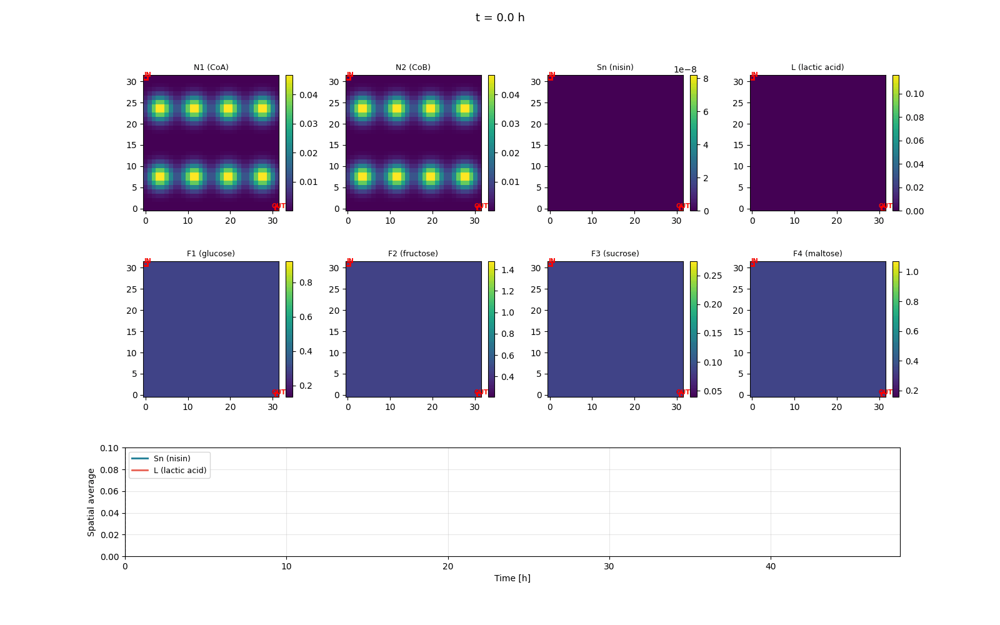

# CooperativeModel

2D reaction-diffusion simulation of a two-strain cooperative microbial consortium (CoA + CoB), implemented in PyTorch.



## Quick Start

```python
from CooperativeModel import Simulator

# Closed 2D reactor with stirring + diffusion (ranking matches ODE)
r = Simulator(
    N1=0.05, N2=0.05, Sn=0.0, L=0.0, F1=0.0, F2=0.0, F3=0.0, F4=100.0,
    mode='batch', t_final=72.0, grid_size=50,
    U_imp=0.5, diffusion_scale=0.1,
).run()
print(f'L={r.L_final:.2f}, Sn={r.Sn_final:.2f}')

# Open reactor with inlet (top-left) / outlet (bottom-right) — the more
# interesting 2D dynamics, but bacteria do not reach steady-state biomass
# within 72 h, so absolute L is small and the ranking does not match ODE.
r = Simulator(
    N1=0.05, N2=0.05, Sn=0.0, L=0.0, F1=0.0, F2=0.0, F3=0.0, F4=100.0,
    mode='flow_through', t_final=72.0, grid_size=100,
    U_imp=0.5, diffusion_scale=0.1, flow_rate=0.05,
).run()
r.gif('flow_through.gif')
```

See [`examples/example.py`](examples/example.py) for the full runnable script.

## Model

### State Variables

| Symbol | Channel | Description |
|--------|---------|-------------|
| $N_1$ | 0 | Population density of strain CoA |
| $N_2$ | 1 | Population density of strain CoB |
| $S_n$ | 2 | Nisin concentration |
| $L$   | 3 | Lactic acid concentration |
| $F_1$ | 4 | Glucose concentration |
| $F_2$ | 5 | Fructose concentration |
| $F_3$ | 6 | Sucrose concentration |
| $F_4$ | 7 | Maltose concentration |

### Well-Mixed ODE (Local Reaction Kinetics)

Each spatial cell evolves according to a cooperative-consortium ODE built on top of [Kong et al. (2018)]. The base structure (Monod growth + diauxic shift + nisin-cooperative production + nisin-protected death) is unchanged; five biological mechanisms have been added on top so that $L_{\text{final}}$ has *interior* optima in the four-sugar input space rather than the single trivial corner-loaded optimum of the original. These additions are listed together in [Mechanisms added on top of Kong et al.](#mechanisms-added-on-top-of-kong-et-al).

The presentation below builds up named intermediates (growth rates, then totals, then production/death rate factors) so that the final ODE system on the right-hand side reads cleanly. The convention is that anything *boxed* on the left of an `:=` is a definition; the final ODE block at the bottom uses only those symbols.

**Step 1 — Per-sugar growth rates** (Haldane for CoA, Monod for CoB):

$$g_{1,i} \;:=\; \mu_{1,i} \, \frac{F_i}{K_{1,i} + F_i + F_i^{2}/K_{\text{inh},i}} \qquad g_{2,i} \;:=\; \mu_{2,i} \, \frac{F_i}{K_{2,i} + F_i}$$

The CoA Haldane form has a maximum at $F_i^{*} = \sqrt{K_{1,i} K_{\text{inh},i}}$ — past this concentration the same sugar that fed CoA starts to inhibit it. With the values in Table 1 the per-sugar peaks sit around $(F_1^{*},F_2^{*},F_3^{*},F_4^{*}) \approx (75, 50, 30, 60)$ g/L, well inside the operating box, which is what makes the lactic-acid landscape multimodal in $(F_1,F_2,F_3,F_4)$.

**Step 2 — Diauxic weighting and totals.** CoA preferentially consumes whichever sugar gives it the fastest individual growth rate, with sharpness $n$:

$$\beta_{1,i} \;:=\; \frac{g_{1,i}^{\,n}}{\sum_{j} g_{1,j}^{\,n}} \qquad \tilde g_{1,\text{tot}} \;:=\; \sum_{i} \beta_{1,i} \, g_{1,i} \qquad g_{2,\text{tot}} \;:=\; \tfrac{1}{4} \sum_{i} g_{2,i}$$

**Step 3 — Lactate product inhibition on CoA total growth.** Accumulated lactate slows CoA but not CoB:

$$g_{1,\text{tot}} \;:=\; \frac{\tilde g_{1,\text{tot}}}{1 + (L/K_{p,L})^{h_L}}$$

The unhatted $g_{1,\text{tot}}$ is what the rest of the equations use. Setting $K_{p,L}\to\infty$ recovers the original uninhibited $\tilde g_{1,\text{tot}}$.

**Step 4 — Net death rate** (per-sugar toxicity attenuated by nisin self-immunity):

$$\delta_1 \;:=\; d_{t_1} \cdot \frac{1 + c_{\text{tox}} \sum_{i} (F_i / K_{\text{tox},i})^{h_{\text{tox}}}}{1 + k_s \, S_n} \qquad \delta_2 \;:=\; d_{t_2} \cdot \frac{1 + c_{\text{tox}} \sum_{i} (F_i / K_{\text{tox},i})^{h_{\text{tox}}}}{1 + k_s \, S_n}$$

The numerator is the *per-sugar toxicity factor*: each sugar contributes its own additive death penalty with its own threshold $K_{\text{tox},i}$. LAB are sensitive to different sugars in different ways (Maillard / methylglyoxal for glucose, osmotic stress for sucrose, transporter overload for maltose), so the toxicity profile is *species-of-sugar* specific, not a function of $F_{\text{tot}}$. This per-coordinate asymmetry is what places the optima at non-uniform interior $F_i^{*}$ rather than along the diagonal. The denominator is **nisin self-immunity**: producer cells of *L. lactis* express the lipoprotein NisI (which binds and sequesters nisin at the membrane and blocks pore formation) and the ABC exporter NisFEG (which removes cell-associated nisin into the medium). Together these saturate at high $S_n$, so the effective death rate decreases monotonically with $S_n$ via the standard $1/(1 + k_s S_n)$ Kong et al. form (Stein et al., *J. Biol. Chem.* 2003; AlKhatib et al., *PLoS ONE* 2014).

**Step 5 — Cooperative nisin production rate** (Kong base × four-sugar co-limitation × CCR):

$$P_m \;:=\; \underbrace{\alpha \, \frac{S_n + r_b}{k_p + S_n} \, F_{\text{tot}} \, \frac{N_1 \, N_2}{k_m + N_2}}_{\text{Kong et al. base}} \cdot \underbrace{\prod_{i} \frac{F_i}{K_{\text{coop}} + F_i}}_{\text{co-limitation}} \cdot \underbrace{\frac{1}{1 + (F_{\text{tot}}/K_{\text{ccr}})^{h_{\text{ccr}}}}}_{\text{CCR}}$$

with $F_{\text{tot}} = \sum_i F_i$. The two multiplicative factors are biologically motivated:

- **Co-limitation** is the *interactive* (multiplicative / Mankin) form, used here for nisin biosynthetic flux rather than for biomass growth: the product is suppressed whenever *any* sugar goes to zero, pushing optima away from the lower bounds of every coordinate. This is the classical product-Monod form for **complementary, non-substitutable inputs** to a single biosynthetic pathway (Megee et al., *Biotechnol. Bioeng.* 1972; Bader, *Biotechnol. Bioeng.* 1978; reviewed in Kovárová-Kovar & Egli, *MMBR* 1998). Saito et al. (2008) categorise this as **Type I (independent) co-limitation** — distinct biochemical roles, all required. Justification for nisin: ribosomal synthesis of the 57-residue precursor, NisB/C-mediated dehydration and cyclisation of Ser/Thr/Cys, and NisT export are all ATP- and cofactor-intensive; sustained throughput requires balanced flux through glycolysis, TCA replenishment, and amino-acid biosynthesis. A diet of one sugar yields imbalanced flux and downregulates secondary metabolism in LAB. The strict Liebig minimum $\min_i F_i / (K_{\text{coop}} + F_i)$ would only track the single most-limiting sugar; the product instead lets all four limitations compound, which is the empirically better fit for complementary inputs (PNAS 2024 dynamic-colimitation framework).
- **CCR** (carbon-catabolite repression) implements CcpA-mediated repression of secondary-metabolite biosynthesis at high carbohydrate load in LAB. It penalises *high* $F_{\text{tot}}$ and pushes optima away from the upper bounds.

Combined with the per-sugar toxicity term in $\delta_j$, these break the "more sugar → more nisin → more bacteria → more $L$" monotonic chain; the result is a multimodal $L$ landscape with $\sim 89$ distinct local maxima, the majority of which lie strictly inside the operating box.

**Step 6 — Final ODE system.** Using the symbols defined above:

$$\frac{dN_1}{dt} = (g_{1,\text{tot}} - \delta_1) \, N_1 \qquad \frac{dN_2}{dt} = \tfrac{1}{\sigma} \, g_{2,\text{tot}} \, N_2 - \delta_2 \, N_2$$

$$\frac{dS_n}{dt} = P_m - k_n \, S_n \qquad \frac{dL}{dt} = Y_L \, g_{1,\text{tot}} \, N_1$$

$$\frac{dF_i}{dt} = -\frac{1}{\gamma_{1,i}} \, \beta_{1,i} \, g_{1,i} \, N_1 - \frac{1}{\sigma \, \gamma_{2,i}} \, g_{2,i} \, N_2 \qquad i \in \{1,2,3,4\}$$

### Parameters (Table 1)

| Symbol | Description | Value |
|--------|-------------|-------|
| $\mu_{1,i}$ | Max growth rate of CoA on $F_i$ | $[0.53,\; 0.5,\; 0.6,\; 0.55]$ h$^{-1}$ |
| $\mu_{2,i}$ | Max growth rate of CoB on $F_i$ | $[0.68,\; 0.64,\; 0.61,\; 0.7]$ h$^{-1}$ |
| $d_{t_1},\; d_{t_2}$ | Max death rates | $0.39,\; 0.34$ h$^{-1}$ |
| $\sigma$ | CoB growth scaling factor | $1.5$ |
| $\alpha$ | Nisin production constant | $0.33$ |
| $k_p$ | Nisin production saturation | $8.0$ |
| $r_b$ | Nisin basal production rate | $0.060$ |
| $k_n$ | Nisin degradation rate | $0.065$ h$^{-1}$ |
| $k_s$ | Nisin death inhibition | $400$ |
| $k_m$ | Nisin cooperative saturation | $0.014$ |
| $K_{1,i}$ | Monod const. CoA | $[0.19,\; 0.2,\; 0.18,\; 0.17]$ |
| $K_{2,i}$ | Monod const. CoB | $[0.72,\; 0.75,\; 0.65,\; 0.6]$ |
| $K_{\text{inh},i}$ | Haldane inhibition const. CoA | $[3.0\!\times\!10^4,\; 1.25\!\times\!10^4,\; 5.0\!\times\!10^3,\; 2.1\!\times\!10^4]$ |
| $\gamma_{1,i}$ | Yield const. CoA | $[0.6,\; 0.7,\; 0.72,\; 0.78]$ |
| $\gamma_{2,i}$ | Yield const. CoB | $[0.575,\; 0.625,\; 0.6,\; 0.5]$ |
| $Y_L$ | Lactic acid yield | $1.0$ |
| $n$ | Diauxic shift sharpness | $2.0$ |
| $K_{p,L},\; h_L$ | Lactate product inhibition (CoA growth) | $35,\; 2$ |
| $c_{\text{tox}},\; K_{\text{tox},i},\; h_{\text{tox}}$ | Per-sugar toxicity death | $1.5,\; [55, 45, 35, 50],\; 1$ |
| $K_{\text{coop}}$ | Co-limitation Hill half-sat. (nisin) | $2.0$ |
| $K_{\text{ccr}},\; h_{\text{ccr}}$ | Catabolite repression (nisin) | $300,\; 2$ |

Note: $k_s$ has been reduced from the original $1.2\!\times\!10^3$ to $400$ in this implementation. The original value places the survival/death boundary at very low $S_n$ which makes the protected/unprotected behaviour effectively bistable across the operating box, collapsing all candidate $L$-trajectories to a single broad plateau. Softening it to 400 moves that boundary into the interior and — combined with the additional kinetic mechanisms above — exposes the multimodal structure of $L_{\text{final}}$ in $(F_1,F_2,F_3,F_4)$.

#### Mechanisms added on top of Kong et al.

The base Kong et al. ODE has a single trivial optimum: max all four sugars. To make the model a useful test bed for spatial / multi-modal optimisation, five biologically-grounded effects are layered on top. Each is gated by a parameter that recovers the original model in a limit, so the additions are opt-in.

| # | Mechanism | Where it acts | Recover original by | Why it's there |
|---|-----------|---------------|---------------------|----------------|
| 1 | Haldane substrate inhibition (CoA) | $g_{1,i}$ growth | $K_{\text{inh},i} \to \infty$ | High sugar inhibits the same uptake it feeds — places per-sugar growth peaks at $\sqrt{K_{1,i}K_{\text{inh},i}}$ inside $(0,100)$. |
| 2 | Lactic-acid product inhibition | $g_{1,\text{tot}}$ | $K_{p,L} \to \infty$ | Standard Luedeking-Piret-style end-product inhibition; couples all four sugars through a shared $L$ pool and breaks the uninhibited yield ceiling. |
| 3 | Per-sugar specific toxicity | death rate $\delta_j$ | $c_{\text{tox}} \to 0$ | Different sugars damage LAB through different routes (Maillard / methylglyoxal for glucose, osmotic stress for sucrose, transporter overload for maltose). Each $K_{\text{tox},i}$ is independent, which breaks the $F_{\text{tot}}$ symmetry and shifts optima away from the equal-mix diagonal. |
| 4 | Multiplicative co-limitation (nisin) | $P_m$ | $K_{\text{coop}} \to 0$ | Bacteriocin biosynthesis treats the four sugars as complementary, non-substitutable inputs to a single secondary-metabolite flux — the product $\prod_i F_i/(K_{\text{coop}}+F_i)$ of four Hill terms is bounded above by 1 and is suppressed whenever any sugar goes to zero. This is Saito et al. (2008) Type I co-limitation in the multiplicative / Mankin form (Megee 1972; Bader 1978), not metabolic cross-feeding between strains. Pushes optima away from the lower bounds. |
| 5 | Carbon catabolite repression (nisin) | $P_m$ | $K_{\text{ccr}} \to \infty$ | CcpA-mediated repression of secondary-metabolite biosynthesis at high carbohydrate load. Penalises high $F_{\text{tot}}$ and pushes optima away from the upper bounds. |

(1) and (3) make the death + growth balance asymmetric across sugars; (2) couples sugars through $L$; (4) and (5) make the nisin-protection signal a non-monotone function of $F_{\text{tot}}$, peaked at moderate values. Together these break the single-optimum structure of the base model: a brute-force scan finds $\sim 89$ distinct local maxima of $L_{\text{final}}(F_1,F_2,F_3,F_4)$, $\sim 30$ of which lie strictly inside $(0,100)^4$.

### 2D Spatial Extension (PDE)

Each field $y_k$ evolves as a reaction-diffusion-advection PDE:

$$\frac{\partial y_k}{\partial t} = R_k(\mathbf{y}) + \nabla \cdot (D_k \, \nabla y_k) - \nabla \cdot (\mathbf{v} \, y_k)$$

where:
- $R_k(\mathbf{y})$ — local reaction rate from the ODE above
- $\nabla \cdot (D_k \, \nabla y_k)$ — Fickian diffusion (8-point stencil, no-flux BCs)
- $-\nabla \cdot (\mathbf{v} \, y_k)$ — advection by a divergence-free velocity field (upwind scheme)

**Diffusion operator** — 8-direction stencil with face-averaged coefficients:

$$\left[\nabla \cdot (D \nabla c)\right]_{i,j} \approx \frac{1}{\Delta x^2} \sum_{k=1}^{8} w_k \, \bar{D}_k \, (c_k - c_{i,j})$$

where $w_k = 1$ for cardinal neighbours and $w_k = 1/\sqrt{2}$ for diagonals, and $\bar{D}_k = (D_{i,j} + D_k)/2$.

**Advection operator** — conservative first-order upwind scheme. We discretise $-\nabla \cdot (\mathbf{v}\, c)$ in flux form. For each cell face, the face velocity is averaged from the two adjacent cell centres, and the upwind concentration is selected based on the flow direction:

$$\Phi^x_{i+\frac{1}{2},j} = \bar{v}^x_{i+\frac{1}{2}} \cdot \begin{cases} c_{i,j} & \text{if } \bar{v}^x_{i+\frac{1}{2}} > 0 \\ c_{i+1,j} & \text{otherwise} \end{cases}$$

where $\bar{v}^x_{i+\frac{1}{2}} = \tfrac{1}{2}(v^x_{i,j} + v^x_{i+1,j})$, and analogously for the $y$-direction. The advection contribution is then:

$$-\left[\nabla \cdot (\mathbf{v}\, c)\right]_{i,j} \approx -\frac{\Phi^x_{i+\frac{1}{2},j} - \Phi^x_{i-\frac{1}{2},j}}{\Delta x} - \frac{\Phi^y_{i,j+\frac{1}{2}} - \Phi^y_{i,j-\frac{1}{2}}}{\Delta y}$$

Upwind is chosen for stability: it introduces numerical diffusion that damps oscillations, and is monotone (preserves non-negativity). This is appropriate here because the physical diffusion operator already provides the dominant smoothing; the advection scheme only needs to be stable, not high-order.

**Diffusion coefficients:**

| Species | $D$ \[$cm^2/h$\] |
|---------|-----------|
| $N_1, N_2$ (bacteria) | $10^{-6}$ |
| $S_n, L$ (small molecules) | $5 \times 10^{-4}$ |
| $F_1$–$F_4$ (sugars) | $10^{-4}$ |

**Velocity field** (`bioreactor_flow`) — single centered circulation cell as the curl of a sinusoidal stream function:

$$\psi(x,y) = A \, \sin\!\left(\frac{\pi x}{L_x}\right)\sin\!\left(\frac{\pi y}{L_y}\right)$$

$$v_x = \partial_y \psi = A \frac{\pi}{L_y}\sin\!\left(\frac{\pi x}{L_x}\right)\cos\!\left(\frac{\pi y}{L_y}\right), \qquad v_y = -\partial_x \psi = -A \frac{\pi}{L_x}\cos\!\left(\frac{\pi x}{L_x}\right)\sin\!\left(\frac{\pi y}{L_y}\right)$$

$\psi = 0$ on all four walls so $\mathbf{v}$ is divergence-free with no-penetration BCs by construction. The amplitude $A$ is rescaled numerically so that $\max|\mathbf{v}| = U_{\text{imp}}$ — peak mean-flow speed is the only stirring knob. Set $U_{\text{imp}} = 0$ for a quiescent reactor.

**Time integration** — Tsitouras 5(4) adaptive Runge-Kutta with dense output via cubic Hermite interpolation and built-in non-negativity clamping.

**CFL condition** — the maximum time step is automatically limited to satisfy both diffusion and advection stability:

$$\Delta t_{\text{diff}} < \frac{\Delta x^2}{2 \, D_{\max} \cdot d} \qquad \Delta t_{\text{adv}} < \frac{\Delta x}{|\mathbf{v}|_{\max}}$$

where $d = 2$ is the spatial dimension. The solver uses $h_{\max} = 0.4 \cdot \min(\Delta t_{\text{diff}},\, \Delta t_{\text{adv}})$. This is computed automatically from the grid spacing, diffusion coefficients, and velocity field — no user tuning required.

### Flow-Through Mode

In `mode='flow_through'`, source/sink terms are added at corner zones:

$$\left.\frac{\partial y_k}{\partial t}\right|_{\text{inlet}} \mathrel{+}= \phi \, (c_{\text{feed},k} - y_k)$$

$$\left.\frac{\partial y_k}{\partial t}\right|_{\text{outlet}} \mathrel{-}= \phi \, y_k$$

where $\phi$ is the `flow_rate` parameter. The feed contains only nutrients (no microbes). Bacteria come from random initial inoculation.

The inlet patch is the upper-left corner (high-row, low-col under `origin='lower'`); the outlet patch is the lower-right corner (low-row, high-col). Inside the outlet patch the velocity is augmented by an additional drain term (+$x$, −$y$) of magnitude $0.2\,U_{\text{imp}}$ on top of the mean stirring flow, so that upwind advection with replicate-pad BCs carries mass off the right and bottom walls.

## Simulator Parameters

| Parameter | Default | Description |
|-----------|---------|-------------|
| `N1, N2` | 0.05 | Initial population densities (CoA, CoB) |
| `Sn, L` | 0.0 | Initial nisin / lactic acid |
| `F1, F2, F3, F4` | 0, 0, 0, 100 | Initial nutrients (glucose, fructose, sucrose, maltose) |
| `mode` | `'flow_through'` | `'batch'` or `'flow_through'` |
| `t_final` | 72.0 | Integration time [hours] |
| `n_output` | 145 | Number of output time points |
| `grid_size` | 100 | Spatial grid points per side |
| `U_imp` | 0.5 | Peak stirring speed [cm/h]. Set to 0 for quiescent reactor |
| `diffusion_scale` | 0.1 | Multiplier on diffusion coefficients |
| `flow_rate` | 0.05 | Inlet/outlet turnover rate [h$^{-1}$] (flow_through only) |
| `device` | `'cpu'` | `'cpu'` or `'cuda'` |

## Results

`Simulator.run()` returns a `SimResults` object:

```python
r.L_final           # final lactic acid (spatial average)
r.Sn_final          # final nisin (spatial average)
r.elapsed           # wall-clock time [seconds]
r.final_values()    # dict of all 8 channels at final time
r.spatial_average() # numpy array [T, 8]

r.gif('out.gif')           # all-channel animated GIF with Sn/L curves
r.snapshot('out.png')      # spatial heatmap at final time
r.timeseries('out.png')    # spatially-averaged time series
```

## Installation

```bash
# Create and activate environment
python -m venv .venv
source .venv/bin/activate    # Linux/macOS
# .venv\Scripts\activate     # Windows

# CPU only
pip install -e .

# GPU (CUDA 12.6)
pip install -e .[gpu] --extra-index-url https://download.pytorch.org/whl/cu126
```

To use GPU, pass `device='cuda'` to the `Simulator`:

```python
r = Simulator(F4=100.0, device='cuda').run()
```

## References

1. Kong, W., Meldgin, D. R., Collins, J. J., and Lu, T. (2018). Designing microbial consortia with defined social interactions. *Nature Chemical Biology*, 14(8), 821-829.
2. Oliveira, A. P., Nielsen, J., and Forster, J. (2005). Modeling *Lactococcus lactis* using a genome-scale flux model. *BMC Microbiology*, 5(1), 39.
3. Marsland, R., Cui, W., Goldford, J., and Mehta, P. (2020). The Community Simulator: A Python package for microbial ecology. *PLoS ONE*, 15(3), e0230430.
4. Tsitouras, C. (2011). Runge-Kutta pairs of order 5(4). *Computers & Mathematics with Applications*, 62(2), 770-775.
